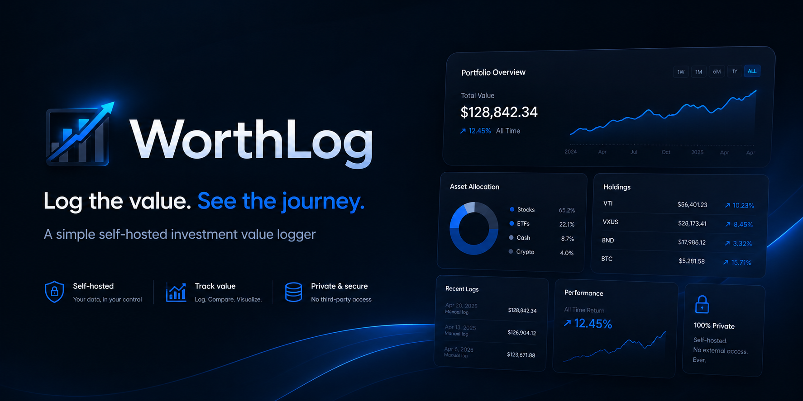
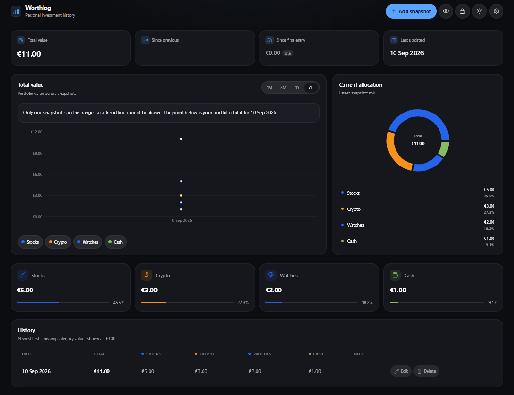
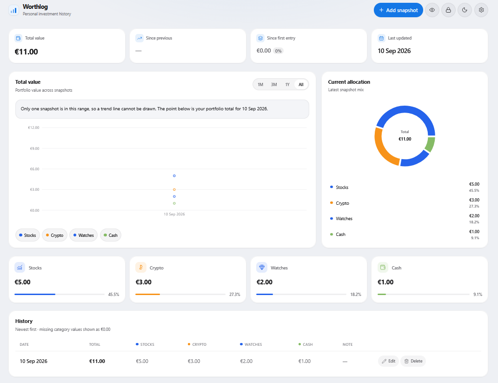

<div align="center">

# Worthlog

**Log the value. See the journey.**

A simple self-hosted app for manually logging investment category totals and watching how your portfolio develops over time.


</div>

<br />

<!-- Maintainer: place the primary dashboard screenshot at docs/screenshots/worthlog-dashboard.png -->
<div align="center">
  
</div>

## What is Worthlog?

Worthlog is a self-hosted investment **value logger**. You choose the dates that matter, open a snapshot form, and enter the total value of each investment category. Worthlog stores those totals and turns them into a clear view of portfolio value, category allocation, and historical development.

Nothing is pulled from brokers or market data providers. Values are entered by you, when you decide a snapshot is worth recording. Categories are fully customizable—names, colors, and icons—so the app can match how you actually think about your portfolio.

The application runs locally, typically through Docker Compose, with all data kept in a SQLite database on your machine. There are no accounts and no external financial APIs.

> [!IMPORTANT]
> Worthlog is intended for a **trusted local network** or personal machine. An optional PIN can restrict access through the web UI and API, but it does **not** encrypt the SQLite database. Do not expose Worthlog directly to the public internet. For remote access, use **HTTPS**, a **VPN**, or an authenticated reverse proxy.

## Features

| Area | What you get |
| --- | --- |
| **Snapshots** | Manual dated portfolio snapshots; edit or delete any snapshot |
| **Categories** | Custom categories with colors and Lucide icons; archive (keep history) or permanently delete |
| **Dashboard** | Total value history, category allocation, and per-category cards |
| **Ranges** | Filter charts and history by 1M, 3M, 1Y, or All |
| **Appearance** | Light and dark themes |
| **Settings** | Display currency, default dashboard range, and optional PIN |
| **Backup** | JSON export and import from the UI |
| **Storage** | Local SQLite database; single Docker container with a healthcheck |
| **Access** | No user accounts; optional portfolio PIN lock |

Worthlog is deliberately **not** a live portfolio tracker, broker integration, transaction ledger, or financial advice platform.

## Screenshots

<div align="center">
  
</div>

<div align="center">
  
</div>

## Quick Start with Docker Compose

**Prerequisites:** [Docker](https://docs.docker.com/get-docker/) and Docker Compose.

```bash
git clone https://github.com/GitTheums/WorthLog.git
cd WorthLog
mkdir -p data
docker compose up -d --build
```

| Item | Value |
| --- | --- |
| App URL | <http://localhost:8787> |
| Health URL | <http://localhost:8787/api/health> |
| Host port | `8787` → container port `3000` |
| Compose service | `worthlog` |

The first build compiles the TypeScript server and React client and may take a few minutes.

```bash
# Check status (wait until the health status is healthy)
docker compose ps

# Follow logs
docker compose logs -f worthlog

# Stop the application (data in ./data is kept)
docker compose down
```

On Linux hosts, if the container cannot write to `./data`, own the directory as UID **1000** (the container `node` user):

```bash
sudo chown -R 1000:1000 data
```

## Installation on a Linux server or Proxmox LXC

Worthlog runs well in a Debian or Ubuntu VM or LXC once Docker and Docker Compose are installed. This section assumes the container host already exists; it does not cover creating a Proxmox LXC from scratch.

```bash
# Clone into /opt (adjust if you prefer another path)
sudo git clone https://github.com/GitTheums/WorthLog.git /opt/WorthLog
cd /opt/WorthLog

# Persistent data directory — must be writable by UID 1000 inside the container
mkdir -p data
sudo chown -R 1000:1000 data

# Build and start
docker compose up -d --build
```

Open **TCP 8787** only on your trusted local network (firewall / security group). Then visit:

```text
http://SERVER-IP:8787
```

## First use

1. A new installation seeds a single active category: **Stocks**.
2. Open **Settings → Categories** to add, rename, reorder, archive, or permanently delete categories.
3. Click **Add snapshot** and enter the total value of each active category for a date you choose.
4. Leave a category field empty if you hold nothing there—it is stored as zero.
5. Create further snapshots whenever you want; charts and history update from those manual entries only.

Archive hides a category from future snapshot forms but keeps its historical values. Delete removes the category and its history permanently (with confirmation).

## Persistent storage

| Location | Path |
| --- | --- |
| Host data directory | `./data` (next to `docker-compose.yml`) |
| Container data directory | `/app/data` |
| SQLite database file | `worthlog.db` → host path `./data/worthlog.db` |

Compose bind-mounts `./data` to `/app/data`. Rebuilding or replacing the container does **not** delete portfolio history as long as the host `data` directory remains.

> [!WARNING]
> Deleting or wiping the host `data` directory **does** delete your portfolio history. Do not run destructive cleanup commands against `./data` (for example `rm -rf data`) unless you intend to erase everything.

## Backup and restore

### JSON export / import (recommended for portability)

In the Worthlog UI: **Settings → Backup and restore**.

- **Export** downloads a versioned JSON file (settings, categories, snapshots, and values).
- **Import** replaces current data after the server writes an automatic timestamped SQLite backup in the data directory.

### Direct SQLite file backup

Stop the container first so WAL files are flushed cleanly, copy the database, then start again:

```bash
cd /opt/WorthLog   # or your clone path
docker compose stop worthlog
cp data/worthlog.db "data/worthlog.db.backup-$(date +%Y%m%d-%H%M%S)"
docker compose start worthlog
```

Keep the backup copy outside the machine if you need off-host recovery.

## Updating Worthlog

Create a database backup first (JSON export or the SQLite copy above), then:

```bash
cd /opt/WorthLog   # or your clone path
git pull
docker compose up -d --build
```

Useful follow-up commands:

```bash
docker compose ps
docker compose logs -f --tail=100 worthlog

# Remove unused build images only — does not remove volumes or ./data
docker image prune -f
```

## Configuration

Application environment variables (see also [`.env.example`](.env.example)):

| Variable | Default | Required | Description |
| --- | --- | --- | --- |
| `PORT` | `3001` (dev) / `3000` (Docker) | No | HTTP listen port inside the process |
| `NODE_ENV` | `development` | No | `development`, `test`, or `production` |
| `DATA_DIR` | `./data` | No | Directory for persistent data; database is `${DATA_DIR}/worthlog.db` |
| `CLIENT_DIST_DIR` | unset | No | Path to the built React app. Docker sets `/app/client/dist` |

Docker Compose also sets `TZ=Europe/Amsterdam` for the container timezone. That value is not read by Worthlog’s own config schema; change it in `docker-compose.yml` if you need a different zone.

### Docker port mapping

| Host | Container | Purpose |
| --- | --- | --- |
| `8787` | `3000` | Browser access to the UI and `/api` |

Change the left-hand side in `docker-compose.yml` if port 8787 is already in use on the host.

## Healthcheck and monitoring

Worthlog exposes:

```text
GET /api/health
```

Example:

```text
http://SERVER-IP:8787/api/health
```

A healthy response looks like:

```json
{ "status": "ok", "database": "ok", "version": "0.1.0" }
```

The Docker image and Compose file include a healthcheck against this endpoint. You can point an uptime monitor such as [Uptime Kuma](https://github.com/louislam/uptime-kuma) at the same URL. Worthlog does not ship a built-in integration with any monitoring product.

## Development

**Requirements:** [Node.js 24](https://nodejs.org/) or newer (see `.nvmrc` and `package.json` `engines`), with the npm version bundled with Node 24.

```bash
git clone https://github.com/GitTheums/WorthLog.git
cd WorthLog
cp .env.example .env
npm install
npm run dev
```

| Process | URL |
| --- | --- |
| Frontend (Vite) | <http://localhost:5173> |
| API (Express) | <http://localhost:3001> |

Vite proxies `/api` to the backend during development.

| Command | Description |
| --- | --- |
| `npm run dev` | Run client and server together |
| `npm run lint` | Lint both workspaces |
| `npm run typecheck` | Type-check both workspaces |
| `npm run test` | Run tests in both workspaces |
| `npm run build` | Production build for server and client |

Workspace-scoped examples:

```bash
npm run dev -w client
npm run dev -w server
npm run test -w server
```

## Project structure

```text
WorthLog/
├── client/               # React + TypeScript + Vite frontend
├── server/               # Express + TypeScript API + SQLite
├── data/                 # Persistent SQLite data (created at runtime; gitignored)
├── docs/
│   └── screenshots/      # README screenshots
├── Dockerfile            # Multi-stage production image
├── docker-compose.yml    # Single-service deployment
├── .env.example          # Documented environment variables
└── package.json          # npm workspaces root
```

## Optional PIN Protection

Worthlog can require a numeric PIN (4–8 digits) before portfolio data is available through the web UI and API.

- **Optional and off by default.** Enable it in **Settings → Security**. Existing installations without a PIN keep working unchanged.
- **Manual lock.** When a PIN is enabled, use **Lock WorthLog** in the header or **Lock now** in Settings. Refreshing an unlocked browser tab keeps the session for up to 12 hours.
- **Not encryption.** The PIN restricts access through Worthlog’s HTTP API and UI. It does **not** encrypt `worthlog.db`. Anyone with filesystem or container volume access can still read the database.
- **Network security still matters.** Plain HTTP does not protect the PIN from interception on untrusted networks. Prefer HTTPS, a VPN, or an authenticated reverse proxy for remote access. Do not expose Worthlog directly to the public internet.
- **Backups.** Normal JSON portfolio exports exclude PIN hash and salt, and restoring a JSON backup does not replace or remove your current PIN. Direct SQLite file backups include the configured PIN hash.

This is a single-portfolio local convenience lock, not a multi-user account system or internet-grade authentication.

## Security

- Prefer a **trusted local network** or personal machine.
- Use the optional PIN to reduce casual access; it is **not** a substitute for HTTPS, a VPN, or host filesystem permissions.
- The database can contain **private financial information**.
- Do **not** expose the app directly to the public internet.
- For remote access, use **HTTPS**, a **VPN**, or an **authenticated reverse proxy**.

## Data and financial disclaimer

Worthlog only displays information you enter manually. It does not retrieve or verify market prices, connect to brokers, or provide financial advice. Charts and totals are derived solely from your snapshots.

## Troubleshooting

### Container will not start

```bash
docker compose ps
docker compose logs worthlog
```

Confirm Docker is running and the image built successfully (`docker compose up -d --build`).

### Permission denied on the data directory (Linux)

```bash
mkdir -p data
sudo chown -R 1000:1000 data
docker compose up -d
```

### Port 8787 already in use

Change the host port in `docker-compose.yml`, for example `"8788:3000"`, then run `docker compose up -d` again.

### Health endpoint unavailable

```bash
curl -sS http://localhost:8787/api/health
docker compose ps
docker compose logs --tail=100 worthlog
```

Wait for the health status to become `healthy` after the first start (`start_period` is 15 seconds).

### View logs

```bash
docker compose logs -f worthlog
```

### Rebuild after an update

```bash
git pull
docker compose up -d --build
```

## Roadmap

Ideas under consideration (not commitments, not available today):

- CSV export
- Portfolio annotations / notes on the timeline
- Additional chart controls
- Optional local access protection

## Contributing

There is no separate contributing guide yet. Bug reports and thoughtful feature ideas are welcome via [GitHub Issues](https://github.com/GitTheums/WorthLog/issues). For larger changes, please open an issue first so the approach can be discussed before you invest time in a pull request.

## License

A license file has not been added to this repository yet. Licensing terms are not specified; do not assume the project is open source or freely redistributable until a `LICENSE` file is published.
